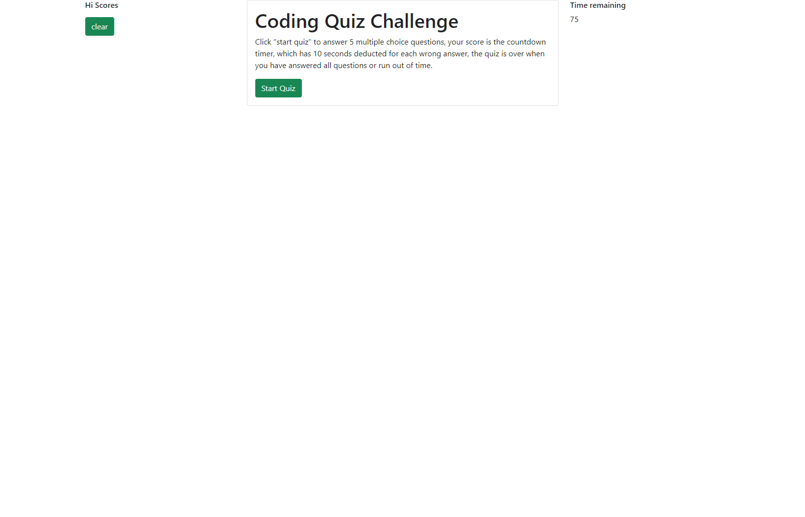
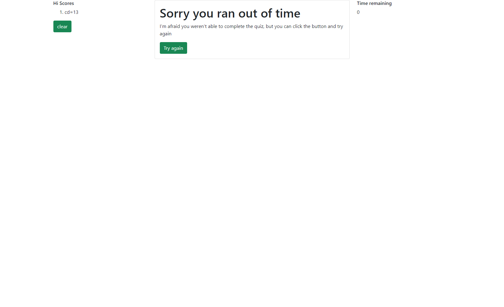
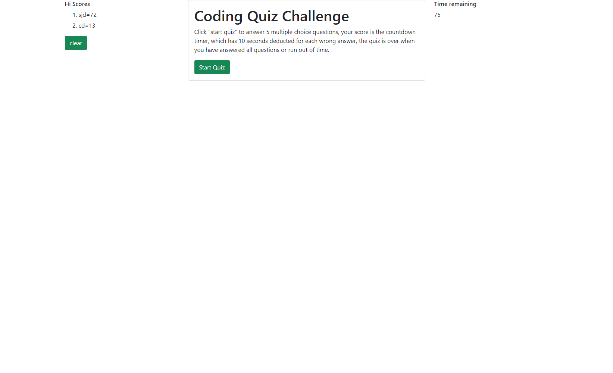

# week-05-code-quiz-homework  

## Aim of the homework  
To create a quiz on javascript that had a countdown timer.  The time would then become the score that could be logged on a hi score sheet.

## How I went about it  
I broke this down into various sections:
..*creating the timer;
..*creating the html and questions;
..*creating the functionality of the page in jQuery;
..*Looking at how to store the initials and score data  

### Creating the timer  
Finding the code to create the timer was straightforward enough, there are plenty of examples on the internet, but working out how to make it only start when the start quiz button was clicked, and making it accessible for later code to access seemed to be a bit of a sticking point for me, but it finally got sorted out by having some aspects of the code within the document ready function, and other apects defined outside of that.  

### Creating the html and the questions  
I created a number of different classes, which I was able to hide and show as the quiz developed.  I used Bootstrap as the basis for much of this, but had to edit parts that were not suitable.  Such as having to remove the form tags from the finish screen, as it seemed to refresh the page, and lose the displaying of the data for the high scores.   

### Creating the functionality of the page  
This was frustrating to say the least.  Much of the code I was writing was very close to being correct, but just in the wrong place, or missing some brackets or other such errors.  The basis of what I was wanting to do, was put the id's of the correct answers in an array, and then check the given answers against that.  Depending on the outcome of that check, the question either moved on to the next when the correct answer was given, or stayed put and deducted 10 seconds for each wrong answer.  

Should the time run out, then people were given the option to retake the test.  Alternatively, if they finished the test with time to spare, they were able to add their score to the hi score board, and then restart the quiz if they wanted to improve their score.  

### Looking at how to store the score data  
I chose to store the intials and score value as objects in an array, each time a new score was created it would be sorted in highest value first order, and placed in the array.  This array stayed until the browser was reloaded.  I could have looked at local storage, but as time was running out, I found this was a quicker method.  

## The finished work

The live site is found at [GitHubPages]: (https://clairemdavies.github.io/week-05-code-quiz-homework/)

Screenshots of the pages that outline the progression of the quiz are as follows:  
  
  
  
  
  